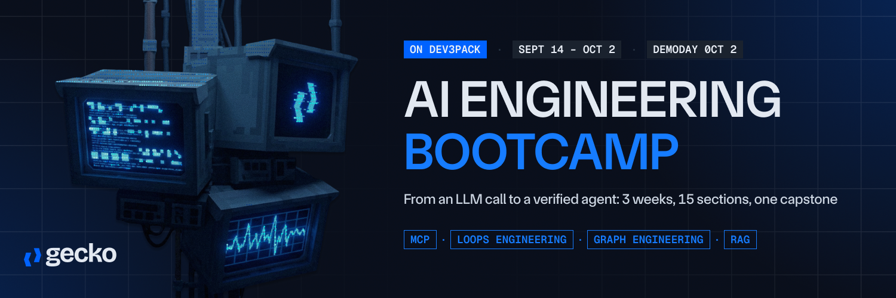

<p align="center">
  
</p>

# Dev3Pack submissions


Where you hand in your work. One folder per chapter, opened as a pull request
from your own fork, and checked automatically.

**The course lives at [Gecko-Academy/dev3pack-cohort-2026-09](https://github.com/Gecko-Academy/dev3pack-cohort-2026-09)**,
and reads at [gecko-academy.github.io/dev3pack-cohort-2026-09](https://gecko-academy.github.io/dev3pack-cohort-2026-09/).
This repository is only the hand-in.

## Contents

- [What you are handing in](#what-you-are-handing-in)
- [How to submit](#how-to-submit)
- [What CI checks](#what-ci-checks)
- [Check it yourself first](#check-it-yourself-before-you-open-the-pull-request)
- [What CI does not check](#what-ci-does-not-check)
- [If CI refuses your submission](#if-ci-refuses-your-submission)
- [The final assignment](#the-final-assignment)
- [Consuming the track](#consuming-the-track)
- [Test data](#test-data)
- [A note for whoever merges](#a-note-for-whoever-merges)
- [Being told instead of asking](#being-told-instead-of-asking)

## What you are handing in

Two files per chapter, and `uv run bootcamp submit` writes both:

```text
submissions/
└── your-github-username/
    └── ch03/
        ├── submission.json   your score, and what passed
        └── notebook.ipynb    your work, which is the evidence for it
```

Your score is a claim and your notebook is the proof. When you open the pull
request, CI checks that the bundle is the right shape, that it sits in your own
folder, that the notebook is the exact file the claim was written against, and
that the score follows from the passes and help the claim itself lists. It does
**not** re-run your notebook yet: that arrives in week 2, and until then every
score in this repository is marked `claimed`, which means self-reported and
shape-checked. A human merges, and the merge is what records the score.

## How to submit

Once, at the start:

1. **Fork this repository.** You never need write access here, only to your own
   fork.
2. Clone your fork.

Then for each chapter, from your course repository:

```bash
uv run bootcamp submit ch03 --github your-github-username
```

It runs the chapter's notebook, prints what passed, and writes
`submissions/your-github-username/ch03/`. Copy that folder into your fork,
commit, push, and open a pull request.

You may submit unfinished work. The file records what passed and what did not,
and re-submitting replaces the earlier attempt.

## What CI checks

- **Your pull request only touches your own folder.** GitHub cannot grant write
  access to one path, so this rule lives in CI instead. It also means nobody can
  overwrite your work.
- **The notebook is the one the score was claimed for**, matched by hash, so a
  score and a notebook cannot be submitted from different attempts. Hand-editing
  `submission.json` fails here.
- **The bundle is the right shape** and the claim names the student whose folder
  it sits in.

## Check it yourself before you open the pull request

The re-run CI cannot do yet, on your own machine, from your course repository:

```bash
uv run python scripts/verify_submission.py submissions/your-username/ch03
```

It copies your notebook into the course, runs it, and compares what its checks
actually print against what your file claims. `VERIFIED` means your submission
holds up.

## What CI does not check

Whether you took a hint. That lives in `~/.bootcamp/progress.db` on your own
machine and never leaves it. `bootcamp submit` reads it and records what it
finds, and help only ever costs marks, so there is nothing to gain by
overstating it.

## If CI refuses your submission

Read what it says, fix the exercise, and run `bootcamp submit` again. The
commonest cause is hand-editing `submission.json`, which is generated and should
be committed exactly as written.

## The final assignment

The final is handed in like anything else, with one extra file:

```
submissions/<your-github>/final/
├── answers.json     what your agent answered, and nothing else
└── notebook.ipynb   the run that produced it
```

`answers.json` holds your agent's answers to the published final questions. Your
agent runs on your machine; only the answers travel. Nothing you wrote is
executed by the course.

When a pull request carrying one is merged, the course scores the answers
against the private key set and writes the result to `finals/<your-github>/`.
That file records the score, both gates and a verdict per question. It does not
record what you answered.

Two gates decide a pass, and the second is the one that matters: 30% of
questions, and **every** question marked critical. Refusing everything reaches
the first and fails the second. Above both, the course issues a signed receipt
and you render your certificate from it.

## Consuming the track

`track.json` at the root of this repository is the machine-readable record, and
the raw URL is the API:

```
https://raw.githubusercontent.com/Gecko-Academy/dev3pack-submissions/main/track.json
```

No key, because everything in it is already public here. Poll it with
`If-None-Match`. Pin a commit in the path instead of `main` if you need the
exact document a reading was taken from.

**The track only moves when the collect job runs.** Its cron asks for every half
hour, and GitHub does not honour that on a quiet repository: on 2026-09-11 the
scheduled runs were two to five hours apart. So do not build a reading on
half-hourly. The webhook below is the signal that is actually prompt, because it
is sent by the run that changed the track.

## Test data

`demo/` holds a track shaped exactly like the real one, three signed webhook
bodies, and the secret to verify them with. It is for building a receiver and a
gradebook view before the cohort starts, without asking us for anything.

Nothing there is reachable from the real track: `render_track.py` writes
`track.json` at the root and never touches that directory. `demo/README.md`
explains what each fixture is there to catch.

## A note for whoever merges

**Let the collect job do it.** Merging a submission by hand puts the files on
`main` without rebuilding the track, so `track.json` keeps saying the work is not
there and nothing is delivered to anybody watching. The track catches up only on
the next collect run. This is easy to miss, because the merge itself looks
completely normal.

## Being told instead of asking

Polling still works and is not going away. But a consumer that keys its own rows
by its own user ids would rather be told, so the collect job can POST a short
notification whenever a merge actually changed somebody's score.

```json
{
  "schema": "dev3pack.webhook.v1",
  "event": "track.updated",
  "repository": "Gecko-Academy/dev3pack-submissions",
  "commit": "b133b8b…",
  "track_url": "https://raw.githubusercontent.com/Gecko-Academy/dev3pack-submissions/b133b8b…/track.json",
  "sent_at": "2026-09-11T21:33:40Z",
  "counts": { "added": 4, "updated": 0, "removed": 0 },
  "truncated": false,
  "changed": [
    { "change": "added", "github": "ernanibmurtinho", "item": "ch03",
      "scored": true, "score": 300, "max_score": 300, "tier": "claimed",
      "submitted_at": "2026-09-10T20:10:46Z" }
  ]
}
```

**The body is a hint and `track_url` is the truth.** That URL is pinned to the
commit, so it cannot change after the fact: a retry, a redelivery or a
notification that overtakes another all resolve by reading it. `changed` is
capped at 500 rows and `truncated` says when the cap was hit, which is why the
summary is never the thing you store.

`change` is `added`, `updated` or `removed`. A removal means the submission left
the tree, and a consumer that only ever upserts would otherwise keep showing a
score this repository no longer holds.

Every request is signed:

```
x-dev3pack-event: track.updated
x-dev3pack-delivery: 403496a5d6eeca3ac961c3afc8dd9593
x-dev3pack-timestamp: 1789421620
x-dev3pack-signature: v1=<hex hmac-sha256>
```

The signature is HMAC-SHA256 over `<timestamp>.<raw request body>` with the
shared secret. **Verify it against the raw bytes**, not against a re-serialised
copy of the parsed JSON, and reject a timestamp more than five minutes old.

```python
want = "v1=" + hmac.new(secret, f"{ts}.".encode() + raw, hashlib.sha256).hexdigest()
ok = hmac.compare_digest(want, request.headers["x-dev3pack-signature"])
```

**Delivery is at-least-once and unordered.** Three attempts with backoff, then
the step goes red and the run stays green, because a subscriber being down is
not a reason to make a cohort's merges look broken. Nothing re-sends
automatically: the `notify` workflow replays a delivery by hand, and it also
sends a `ping`, which carries the same envelope with no `changed` list so a
receiver can be verified before anybody has submitted anything.

To turn it on, set `DEV3PACK_WEBHOOK_URL` as a repository variable and
`DEV3PACK_WEBHOOK_SECRET` as a repository secret. With neither set, nothing is
delivered and the build stays green, which is what should happen before a
subscriber exists.

The rules a consumer must follow, because the document cannot enforce them:

- **`schema` is `dev3pack.track.v1`.** Refuse any other value. Additive fields
  never bump it; a break ships as a new file.
- **Render `tier` beside every score.** `claimed` is self-reported and
  shape-checked, `verified` means a re-run agreed, `unverifiable` means it can
  never be re-run, `handed in` means the item is not marked. A score without
  its tier is a misreading.
- **A missing `(github, item)` row means not submitted**, never zero. `score: 0`
  is a submission where nothing passed.
- **`scored: false` means no arithmetic.** `score` and `max_score` are `null`;
  render the word, and leave the row out of totals.
- **One row per `(github, item)`.** A resubmission replaces the row and drops
  its `verified` tier, on purpose. Upsert on that key; never append.
- **`items[]` is the denominator.** It lists every chapter that can be handed
  in, with `max_score` and whether it is scored, so a blank cell has a shape.
- **`submitted_at` is the student's clock.** For "changed since", use the
  commit, not that field.
- **Non-empty `problems[]` means the document is partial**, and each entry
  names the file that could not be read.

Grades, certificates and the final assignment are not in this file and never
will be. They are decided at demo day and delivered separately.
