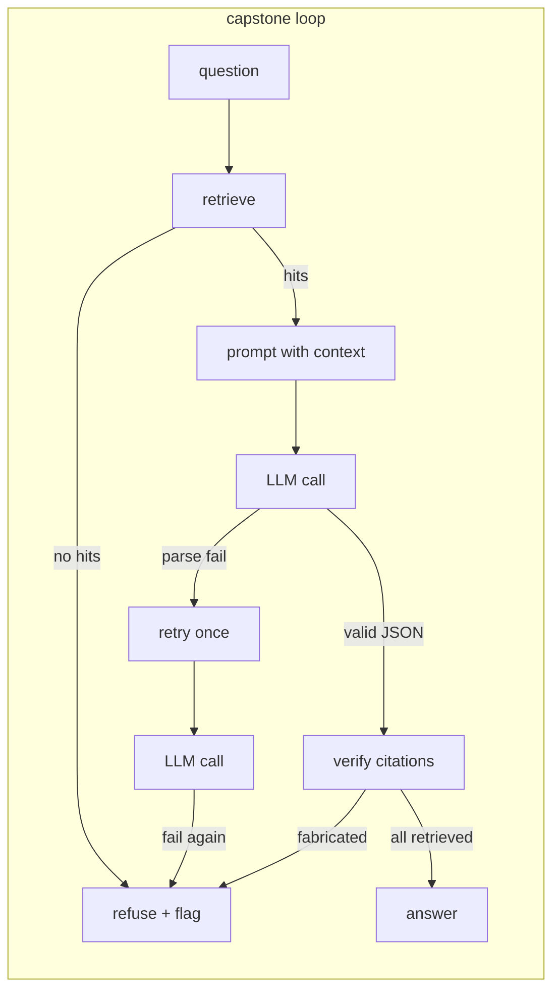
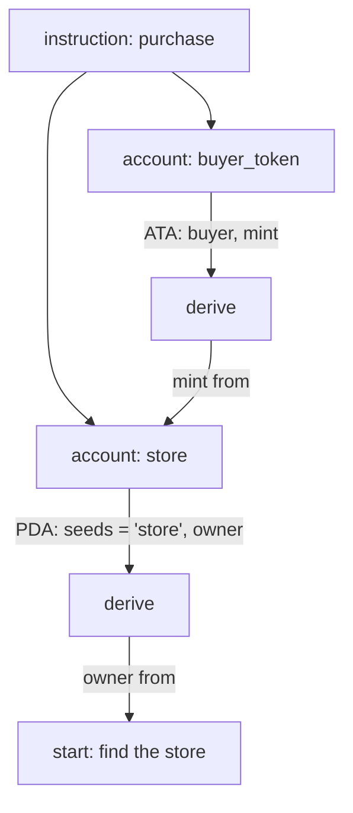

# Graph Engineering

*Thread sessions: 6–8 (retrieval → state machines) and 13 (Gecko's program
graph). Reference implementations: `src/bootcamp_agent/retrieval.py`,
`src/bootcamp_agent/agent.py`.*

Agents fail when their picture of the world is a flat list: a pile of chunks, a
bag of endpoints, a menu of tools. Real systems have *structure* — this depends
on that, this must happen before that, this value derives from that one — and an
agent that cannot see the structure has to guess it. Graph engineering is the
habit of making the structure explicit: nodes, edges, and — crucially — where
each edge came from.

## Level 1: metadata is the first edge

Even our six-document corpus is already a graph. Each chunk carries
`doc_id` and `position` (`retrieval.py`), each document carries `tags` and
`source`. Those fields are edges: chunk→document, document→topic. They are what
make a citation checkable — `agent.py` verifies every cited doc_id against the
retrieved set, which is a graph-membership test. A citation with no edge to a
retrieved node is a fabrication, and we strip it.

The lesson generalizes: **any metadata you keep is an edge you can later
verify against.** Retrieval without metadata produces answers you can only
grade by vibes.

## Level 2: the workflow is a graph — draw it

Session 8 builds the same task three ways. The differences are invisible in
prose and obvious as graphs:

Every arrow is a decision you made and can now defend, test, and put a budget
on. A "state machine" is nothing more than this drawing taken seriously: named
states, explicit transitions, no edges you didn't draw. When a colleague asks
"what happens when parsing fails twice?", the graph answers in one glance.

## Level 3: the API surface is a graph too

The payoff comes in Session 13. A real API — especially a Solana program — is
not a list of endpoints. It is a dependency graph: instruction X needs account
A; account A is a PDA derived from seed S; seed S comes from the result of
instruction Y. A flat list ("here are 12 instructions") hides exactly the edges
an agent needs to make the call correctly on the first try:

This is what Gecko builds when it *comprehends* a program: the
instruction↔account graph, the derivation order (you must resolve the store
before you can derive the buyer's token account), and — the part that makes it
trustworthy — a **provenance tier on every edge**: was this edge declared in the
IDL, recovered from source, measured by execution, or merely inferred? An edge
that says where it came from can be audited; an edge that doesn't is a guess
wearing a suit.

`find_start` is graph routing: given a plain-English intent ("buy a coffee from
this store"), walk the graph to the correct *starting* node — because in a
dependency graph, the first call is determined by the edges, not by which
endpoint name sounds right.

## The habit

1. When you store data an agent will use, keep the relationships, not just the
   items.
2. When you build a workflow, draw it before you code it; every arrow becomes a
   test.
3. When you consume someone else's surface, ask what the edges are and *how
   they were established* — declared, recovered, measured, or inferred.
4. When an agent must act on the structure, route by the graph (what must exist
   first?) rather than by name similarity.

## Exercises

- Draw the mermaid graph of your Session 8 reflection workflow, including the
  failure edges. Compare with a colleague's — do your graphs disagree about an
  edge? One of you has a latent bug.
- In Session 13, after `comprehend_program`, pick one PDA account and write out
  its derivation chain by hand. Then ask a naive assistant how to derive the
  same account, and diff the two answers.
